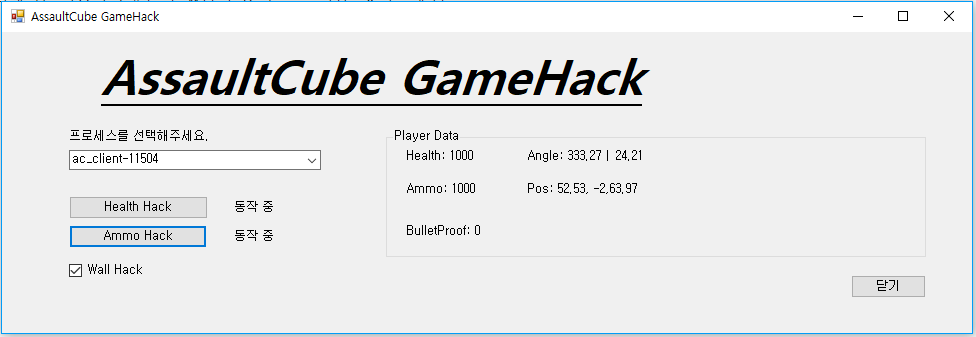
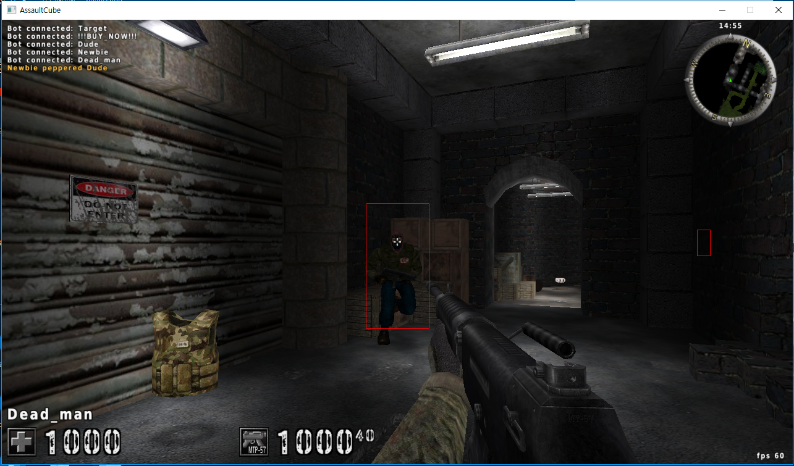

# AssaultCube GameHack

##### 1. 프로젝트 소개

이 프로젝트는 유투브 채널 "[재즐보프](https://www.youtube.com/channel/UCW_PO0316aD16L3IcD34wPg?sub_confirmation=1)"에서 게임핵 개발 및 시큐어 코딩이라는 주제를 가지고 C#으로 만든 게임핵 코드입니다. **불법적인 이용에는 사용을 삼가시고 학습에만 사용해주시기 바랍니다. ** 실시간으로 코딩하는 영상은 아래 링크에서 확인 가능합니다.

[유투브 채널 : 재즐보프](https://www.youtube.com/channel/UCW_PO0316aD16L3IcD34wPg?sub_confirmation=1)

※ 현재 이 프로그램은 릴리즈된 다른 프로그램에서는 사용하지 못할 수 있습니다. 이 프로그램은 깃허브에 업로드된 AssaultCube 소스를 다시 직접 컴파일하여 적용하였으므로 릴리즈된 버전에서는 동작하지 않을 수 있습니다. 이런 경우에 사용하고 싶다면 직접 치트엔진을 사용해 구조체에 대한 주소를 파악하시면 됩니다. 유투브 영상에 방법을 모두 담아 두었습니다.

##### 2. GUI

##### 3. 테스트 환경

- Windows 10 Pro
- Microsoft Visual Studio Community 2017 버전 15.5.6

##### 4. 기능 

- 체력 무한 핵 (체력을 1000으로 변경)
- 탄약 무한 핵 (탄약을 1000으로 변경)
- 에임 핵 (가장 가까이 있는 적을 에임)
- 오버레이를 사용한 월핵 (적의 위치를 파악하여 화면상에 네모 박스를 그림)

##### 5. 사용법

- AssaultCube 게임을 시작합니다.
- ac_clinet(AssautCube) 프로세스를 선택합니다.
- 다른 팀원들과 게임을 시작합니다.
- 게임을 시작하면 player Data 박스에 게임 중인 사용자 정보를 읽어 올 수 있습니다.
- 기능 리스트(체력 무한 핵, 탄약 무한 핵, 월핵) 중에 원하는 항목을 클릭하면 핵이 동작합니다.
- 게임 중 마우스 오른쪽 키를 클릭하면 에임핵이 동작합니다.

##### 6. 게임 중 예시 화면 